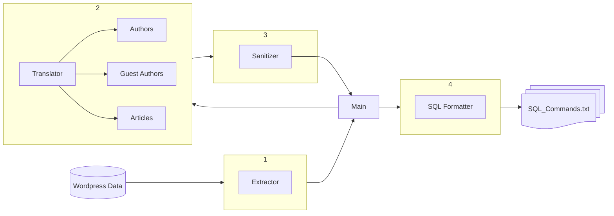

# Preface
The Triangle's current website is hosted on Wordpress, using a large number of PHP extensions to fit their needs. Over 11 years of use, the build has become very unstable. Updates to PHP lead to many of the extensions breaking, forcing hotfix after hotfix. One of the current missions of the IT team is to migrate all of this data onto our new server, PRISM. The goal of this tool is to handle the migration of needed data from wordpress onto our own local machine.

# General Idea

The project boils down into 4 main components:
1. The Extractor brings in .xml files into a Python dictionaries.
2. The Translator parses the dictionaries into objects for easier editing.
3. The Sanitizer parses all of our data and unifies all of our data.
4. The Formatter formats our data to fit into SQL tables.

The rest of the README will explain each one of these steps in further detail.
---
## 1. Extractor
```python
class Extractor:
  def __init__(self, posts, guestAuths):
    self.value = 0
    self.postsFile = posts
    self.guestAuthsFile = guestAuths
    self.data = {
      'auth': None,
      'guestAuth': None,
      'art': None 
    }
```
The extractor class is responsible for grabbing the data from Wordpress(WP) and converting it into Python dictionary objects for easier data manipulation. WordPress data can be exported from the admin page as a `.xml` file. In addition to exporting any posts, we need to also grab Guest Authors, as that was a plugin we used to handle non-Triangle member authors. As of now, we have no way of remotely grabbing fresh data from WP, so the repo is currently using a zipped file which holds the two `.xml` files currently in question. The class unzips them and converts them to necessary dictionaries, which then get inserted into the `data` instance variable.

A future goal would be to remotely grab the data so no one has to manually login and grap `.zip` files, but that will be revisted after the main job is done.

## 2. Translator
```python
class Translator:
  def __init__(self, source):
    self.source = source
    self.objCount = 0
    self.objDataDict = {}
```

The Translator's main purpose is to parse the data inside an Extractor's `data` variable, iterating over each dictionary to translate Wordpress keys into more readable values. You can think of it as a filter: looking through each dictionary, grabbing the data that we need to then be mapped to a new variable name, and omit everything else. Each object made will then be added to a giant dictionary. This allows not only for logging the data, but will let us sift through this data at a later time for further manipulation, which you will see shortly. 

As of now, there should only be three items that need translating:
1. Authors
2. Guest Authors (gAuthors)
3. Articles

A child class will be made to inherit the Translator class, and each child's `translate()` function will be overloaded. This is for later convenience when we call these functions:
```python
translators = {
  "articles": ArticleTranslator(extracted["art"]),
  "gAuth": GuestAuthorTranslator(extracted["guestAuth"]),
  "auth": AuthorTranslator(extracted["auth"])
}

for key in translators:
  translators[key].translate()
```

## 3. Sanitizer
```python
class Sanitizer:
  def __init__(self, policies):
    self.policies = policies
  
  def sanitize():
    ...
```
This will probebly be where the most annoying step of this entire process will occur. If you look into text of articles, or the names of some authors/g-authors, you'll notice irregularities inside the data. The goal of these sanitizers is to resolve all of these errors to leave clean, sanitized data for future reference. It is to be noted that articles, authors, and gAuthors will have slightly different issues: they might share some common errors, but it is worth going through the data yourself and confirming the existence of irregularities. Here are a few off the top of my head, using the author dictionary as our example:

---
---
### Data Alignment Errors
For example, Ava Heckler (author id #1):
```json
"1": {
        "id": 1,
        "login": "ava haekler",
        "email": "ava.haekler@thetriangle.org",
        "display_name": "Ava Haekler",
        "first_name": null,
        "last_name": null
    }
```
We know her first name and last name, and yet those values are set to null here. I'm calling this a data alignment error. Everything is technically there, it just isn't formatted to our best standard.

### Formatting Error

```json
"55": {
  "id": 55,
  "login": "ae.desk",
  "email": "entertainment@thetriangle.org",
  "display_name": "Entertainment Desk",
  "first_name": "A&amp;E",
  "last_name": "Desk"
},
"67": {
  "id": 67,
  "login": "tyler.chance",
  "email": "tyler.chance@thetriangle.org",
  "display_name": "Tyler.Chance",
  "first_name": "Tyler",
  "last_name": "Chance"
},
```
For author #55, you have the ampersand character being represented by the XML escape character `&amp;`. 
For author #67, we have a period instead of a space inside our display name. 
These formatting errors are due to a combination of xml escape characters, as well as just weird formatting from the old WP data. 

### Aggregate User Errors (Database Mending)
```json
"204": {
    "id": 204,
    "login": "granny-and-eloise",
    "email": "advice1@thetriangle.org",
    "display_name": "Granny &amp; Eloise",
    "first_name": "Granny",
    "last_name": "Eloise"
},
"502": {
  "id": 502,
  "login": "jenna-oneill-and-amelia-erb",
  "email": null,
  "display_name": "Jenna O'Neill and Amelia Erb",
  "first_name": null,
  "last_name": null
},
"520": {
  "id": 520,
  "login": "jenna-oneill",
  "email": null,
  "display_name": "Jenna O'Neill",
  "first_name": null,
  "last_name": null
},
"560": {
  "id": 560,
  "login": "amelia-erb",
  "email": null,
  "display_name": "Amelia Erb",
  "first_name": null,
  "last_name": null
},
```
Here, authors Amelia Erb and Jenna O'Neill are separate authors. An article that they both written is credited towards a new author, "Jenna O'Neill and Amelia Erb", instead of the two of them individually. We need to basically do three things with these aggregate users:
1. Correctly Identify the multiple users that exist for the aggregation. If one of them does not exist, create a user
2. Any article that was written by the aggregate user must be mapped back to those two individual authors
3. Delete the aggregated user after ensuring every article it was credited it with was re-mapped.

This is the most fun as not wverything with an `"and"`/`'&'` is necessarily an aggregated user (For example, Author #204 refers to a section of articles written by the characters "Granny & Eloise". There is no need to separate these two).


### Special Cases
```json
"4": {
  "id": 4,
  "login": "maya.kamami",
  "email": "maya.kamami@thetriangle.org",
  "display_name": "Eunice Maya Kamami",
  "first_name": "Eunice Maya",
  "last_name": "Kamami"
},
"91": {
  "id": 91,
  "login": "the triangle sports desk",
  "email": "sports@thetriangle.org",
  "display_name": "The Triangle Sports Desk",
  "first_name": "The Triangle",
  "last_name": "Sports Desk"
},
"98": {
  "id": 98,
  "login": "the triangle news desk",
  "email": "news@thetriangle.org",
  "display_name": "The Triangle News Desk",
  "first_name": "The Triangle News Desk",
  "last_name": null
},
"460": {
  "id": 460,
  "login": "st.-christophers-hospital-for-children",
  "email": null,
  "display_name": "St. Christopher's Hospital for Children",
  "first_name": null,
  "last_name": null
},
```
There are a couple of special cases, where the author doesn't fit the orthodox standard of "First Last". A lot of these come from organization names, or Triangle Section Desks. However, there are also people, that will also have more than two names. There isn't really a scenario for these ones in my head yet, as I don't know how they should fit onto the database. Conversing with Kenneth or Daniel might be best practice for dealing with these cases, but for now let's apply the following policy:
1. If the name belongs to a person, put the very last name in `last_name` and store the rest in `first_name`. It's to be noted that hyphenated words count as one word:
```json
"777": {
  "id": 777,
  "login": "one-two-three-four",
  "email": null,
  "display_name": "One Two Three Four",
  "first_name": "One Two Three",
  "last_name": "Four"
},
"777": {
  "id": 777,
  "login": "one-two-three-four",
  "email": null,
  "display_name": "One Two Three-Four",
  "first_name": "One Two",
  "last_name": "Three-Four"
},
```

2. If the name belongs to a company/organization or a Triangle desk, store everything in `first_name`:
```json
"68": {
  "id": 68,
  "login": "op.ed",
  "email": "op-ed@thetriangle.org",
  "display_name": "Op-Ed",
  "first_name": "The Triangle Op-Ed Section",
  "last_name": null
},
```
I HIHLY recommend cleaning the authors and gAuthors first before dealing with the behemoth that are articles. Sifting this step out will essentially allow us to do the mass article-author migration with no problem. My suggestion for this santizing would be:
1. Identify as many errors as possible
2. Construct policeis that automatically mend as much data as possible.
3. Manually sift through remaining errors, and construct a file that takes will automatically re-execute those steps the next time something is ran. 

Once you get through the articles, people should work together to try and identify errors. Don't spend too much time identifying errors here, as this being perfect isn't necessary for our tables. Catch any weird stuff, and then move on. 

